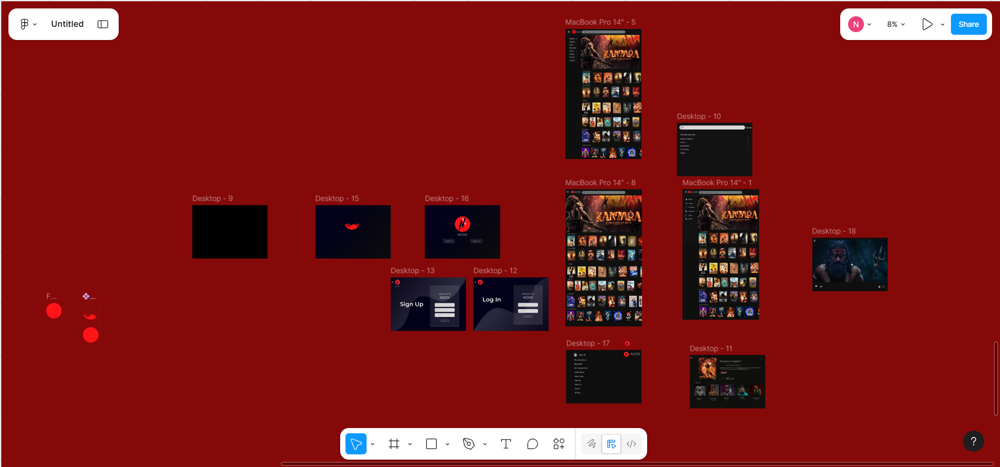

# NOXX – UI/UX Design Project

NOXX is a **UI/UX design project created using Figma**. The project focuses on designing a modern and user-friendly interface for a digital platform. It demonstrates the principles of **user experience, visual design, and interactive prototyping**.

## 🎨 Project Overview

The NOXX project was designed to showcase clean layouts, intuitive navigation, and modern UI components. The design emphasizes usability, accessibility, and a visually appealing user interface.

## ✨ Features

* Modern and minimal UI design
* User-friendly interface
* Well-structured layout
* Consistent color scheme and typography
* Interactive prototype created in **Figma**

## 🛠️ Tools Used

* **Figma** – UI/UX design and prototyping
* Design components and auto-layout
* Wireframing and high-fidelity UI design

## 📂 Project Files

This repository contains:

* Design screenshots
* UI screens
* Figma prototype link

## 🔗 Figma Prototype
https://www.figma.com/design/wCSfrcuYXFOAJMtAfM2Vo0/Untitled?node-id=0-1&t=VCLcd90bfHIiXYqG-1

## 📷 Screenshots

### Design View

### Prototype View

## 🎯 Purpose of the Project

The purpose of this project is to practice **UI/UX design principles**, create visually appealing user interfaces, and learn **prototyping using Figma**.

## 🔮 Future Improvements

* Add more screens and user flows
* Improve interaction design
* Conduct user testing
* Convert the design into a real web or mobile application

## 👨‍💻 Designer

**Naveen Asundi**

## 📜 License

This project is created for educational and portfolio purposes.
